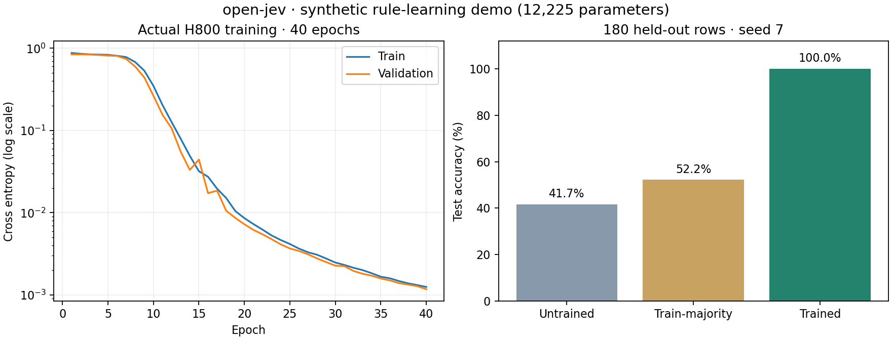

# open-jev

An independent, modular PyTorch framework for typed decision models. It turns a state plus a typed question into a probability distribution over dynamic candidates, with replaceable tokenizers, encoders, scoring heads, training loops, metrics, and HTTP serving.

`open-jev` is **not** TypeSafe's Jev model and does not claim to reproduce its private architecture, weights, or training data. It is an open implementation inspired by the public problem shape: calibrated decisions over Choice, Noul, and Score questions. See the [TypeSafe introduction](https://docs.typesafe.ai/introduction) for the hosted product.

## Quick start

```bash
python -m venv .venv && source .venv/bin/activate
pip install -e '.[dev]'
pytest
```

## Run an actual training experiment

```bash
open-jev train-synthetic --output artifacts/my-run \
  --groups 600 --epochs 40 --batch-size 32 --seed 7 --device auto
```

Use `--device cuda` to require CUDA (fails if unavailable), or `--device cpu`.
The source-checkout equivalent is `PYTHONPATH=src python scripts/train_synthetic.py`
with the same arguments. The runner creates four JSONL splits, per-epoch logs,
a self-describing checkpoint, held-out predictions and metrics, hashes, and
hardware evidence. It restores the best validation checkpoint before evaluation.

A complete [recorded H800 run](examples/synthetic-v2/README.md), including data
and weights, is checked in. Across 180 held-out rows, the initialized model
achieved **41.7%** accuracy, a train-majority baseline **52.2%**, and the trained
model **100%** after 40 epochs (24.9 seconds). This is a simple synthetic rule
learning demonstration with 12,225 parameters, not evidence of real-world or
TypeSafe Jev parity. The reserved calibration split is unused.



[中文训练报告](docs/reports/2026-09-21-h800-synthetic.md)

The core API is deliberately small:

```python
from open_jev import Example, Question
from open_jev.batching import collate
from open_jev.tokenization import WhitespaceTokenizer
from open_jev.model import DynamicDecisionModel

question = Question(type="choice", instructions="Choose a route", criteria={"safe": "low risk", "fast": "low latency"})
example = Example(id="1", state={"latency_ms": 120}, question=question, label="safe")
tokenizer = WhitespaceTokenizer.fit([example])
model = DynamicDecisionModel(len(tokenizer), hidden_size=64)
```

JSONL examples are validated with Pydantic and preserve `id`, `group`, `source`, and raw `state` for auditability. Splitting isolates groups and identical states before training. Calibration data is kept separate from model fitting.

## Architecture

```text
JSONL -> schema -> grouped split -> tokenizer -> encoder -> dynamic scorer
                                             |-> soft CE / Brier / ECE
                                             |-> checkpoint -> FastAPI
```

The included baseline uses a deterministic whitespace tokenizer, mean pooled embeddings, and a permutation-equivariant candidate scorer. Each part can be replaced without changing the typed data contract. A future `hf` extra is reserved for Hugging Face tokenizers and backbones; the base package does not download model weights.

## Scope and limitations

This repository is a clean, runnable baseline rather than a proprietary-model reproduction. The included synthetic checkpoint is only a pipeline demonstration. No pretrained language model or TypeSafe parity is provided, and domain calibration requires representative held-out data. Before production use, add task-specific data governance, adversarial tests, monitoring, access control, and temperature calibration.

## Development

```bash
ruff check src tests scripts
pytest -q
```

Licensed under Apache-2.0.

